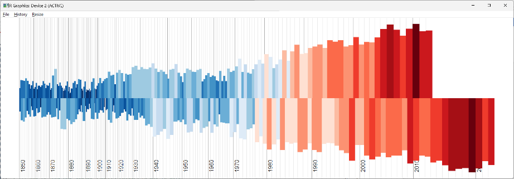
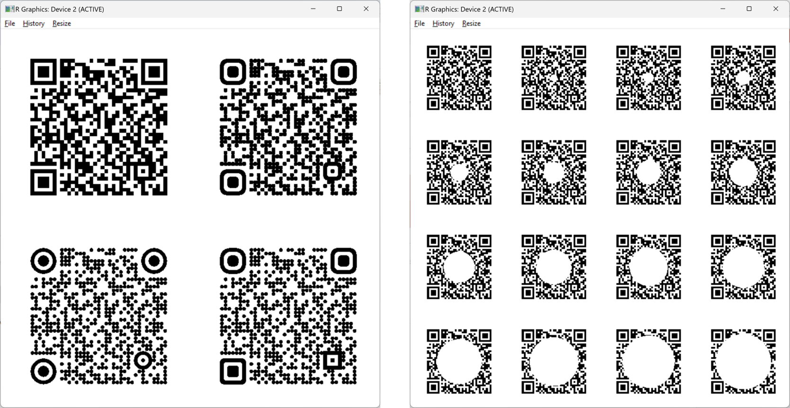

# WhatNots - data and tools from the MASC Data Visulisation, CIM, Warwick 


Whatnots shares some, but not all, R code and data files used in our MASC Data Visualisation teaching (https://warwick.ac.uk/fac/cross_fac/cim/apply-to-study/masters-programmes/visualisation/). 

It might be of use in your own teaching, research or learning. The scripts and files are shared ‘as is’ with no liability and, importantly, without sharing the context of how we use them in teaching. Please get in touch if you find any bugs.

In some cases the visualisations given below are illustrative of what can be produced using the data, rather than necessarily being produced by those functions. Students have used this data for visualisation projects in our modules. 


##  1. query temperature data from https://berkeleyearth.org/ 

Many climate visualisations use data from https://berkeleyearth.org. This generic function returns climate data for a `focalCountry`. The script formats the data in a simple, usable style. 

The country name/format follows that of BerkleyEarth.org such that this will work:

`get_berkley_earth_climate_data( "Cook Islands" )`

But this will return an error:

`get_berkley_earth_climate_data( "Cook-Islands" )`

As a brief explanation, the function concatenates the URL from a country name, reading that data from line 51 (using `skip`) as follows:

```
  focalCountry <- "Kenya"
  dataUrl <- paste("https://berkeleyearth.org/wp-content/themes/client-theme/temperature-data/",
                     focalCountry,
                     "-projection.txt", sep="")
    thisData <- read.table( dataUrl, skip=51 )'
  names( thisData ) <- c("Year", "AnnualAverage", "AnnualAverageUncertainty",           "10YearSmooth", "SSP1-2.6", "SSP2-4.5", "SSP3-7.0", "ModelHistorical") 
```


After renaming the columns, this data file is itself renamed, and outputted by the function.
```
    countryNameWithoutBlankSpace <- gsub( pattern = " ", replacement = "", x =            focalCountry )
    countryNameWithoutBlankSpaceOrDashes <- gsub( pattern = "-", replacement = "",         x = countryNameWithoutBlankSpace )
    countryDataName <- paste( countryNameWithoutBlankSpaceOrDashes,
                              "Data", sep="")
    assign( countryDataName, thisData  )
```

The function executes these steps and so is easier to de-bug and modify, and easier to run in batch mode. 





## 2. US election voting data as shape files (1976 to 2020)

The output shape files – `elect_states.shp` - has:

+ each row is a state
+ columns  include
    + fips code (unique numerical identifier for each state)
    + state name 
    + two letter, abbreviated state name 
    + votes (absolute number and proportion) for every fourth year from 1976 to 2020,
    + by dominant parties (Republican & Democrat) or “Other”
    + centroid (lat/long) of each state for labelling
    + sf spatial 'geometry' (Type: MULTIPOLYGON) in last column

The file is generated by a script merging US voting data from the MIT Election Data and Science Lab (https://doi.org/10.7910/DVN/42MVDX) with the spatial available through the tigris R package (Walker 2023, https://github.com/walkerke/tigris). 
The goal is to produce shape files of voting data for Republicans, Democrats and Other, and for each voting year. 

Amongst other considerations, the merge requires: 
+	Removing voting and spatial data that does not relate to states (e.g. overseas territories, below state voting data)
+	Aggregating votes for parties other than Republican and Democrat.


## * 3. QR code plotting and formatting 

The 'qrcode' R package (https://cran.r-project.org/web/packages/qrcode/index.html) produces a matrix describing a qr code for a given url. Based on the output of 'library(qrcode)' these functions:
1. `qr_matrix_2_dataframe` - convert the matrix into a data frame format
2. `qr_plot` - plot the qr code from the data frame with a rounded rectangle which can produce rectangles, circles, or rounded rectangles (the shape type is defined for the whole qr code or individually defined for individual guides and the main content).
3. `qr_test_redundnacy_swatch` - produce a test swatch to evaluate the redundant usable area that may be over-plotted.

This format allows a QR code to be plotted into a visualisation produced in R, or exported on its own.  





## * 4. More


## * 5. More


